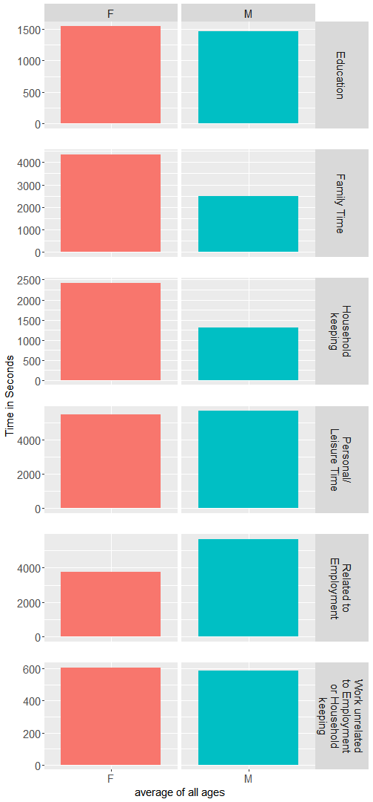

## The Dataset
The data used in this small project is the result of the Time Use Survey(TUS) which had in mind the measurement of the amount of time people spent on various activities throughout the day. data is filled by individuals who keep a diary that they can fill, so this data is self reported and should be treated as such.  
The dataset contains data from two waves of those surveys, part of the Harmonized European Time Use Survey(HETUS). First wave containing 15 countries with the interviews taking place between 1998 and 2006, referred as the 2000 period from now on, and the second wave taking place between 2008 and 2015 in 18 countries, from now on referred as the 2010 period.
What we were interested from this dataset was to see specifically the kind of main activities, found as the Activity Coding List(ACL) in the dataset, people usually participated in and about how much time individuals who participated in certain activities spent.  
The diaries that the participant were supposed to complete had every 24h day that they were supposed to fill in split into 144 slots of 10 minutes each of those slots were marked with one of 108 categories of activities, of which they ended up reduced as 51 different categories.   

## A Few Observations

Here we have a graph that shows the mean time spent by Male and Female counterparts on different types of activities:

As we can see from the above graph, in general women spend more time on activities related to family care, as childcare, and on work that entails maintaining a household, while males usually spend more time at work or work related activities  

It might be useful to have a closer look at how people are using their time depending on age groups, as we have observed that differences can be quite big depending on the age of the volunteers  

